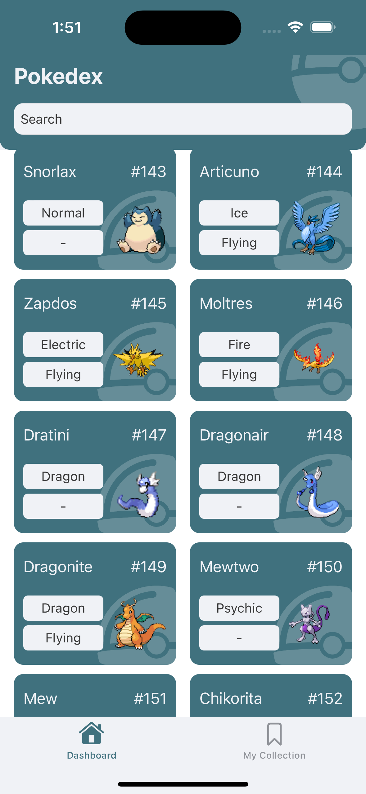
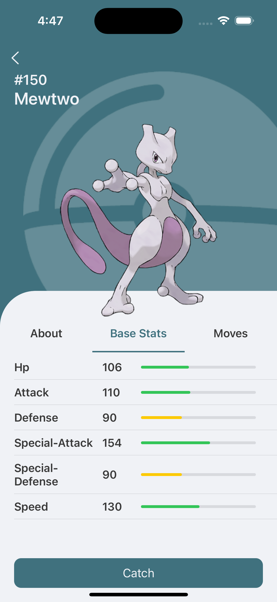
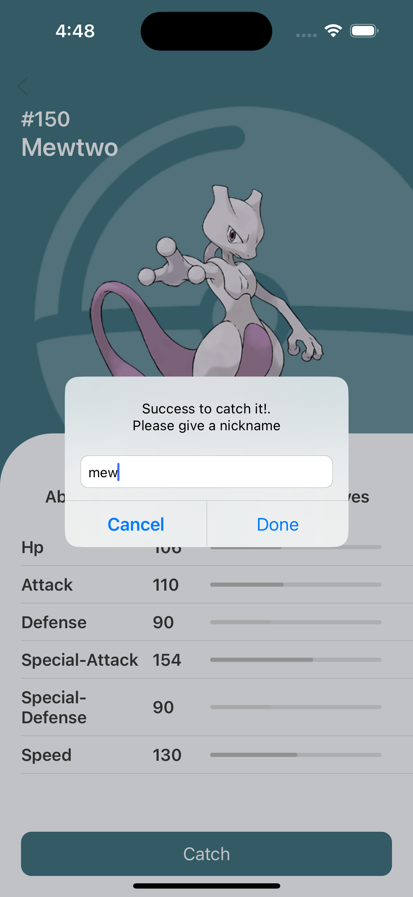
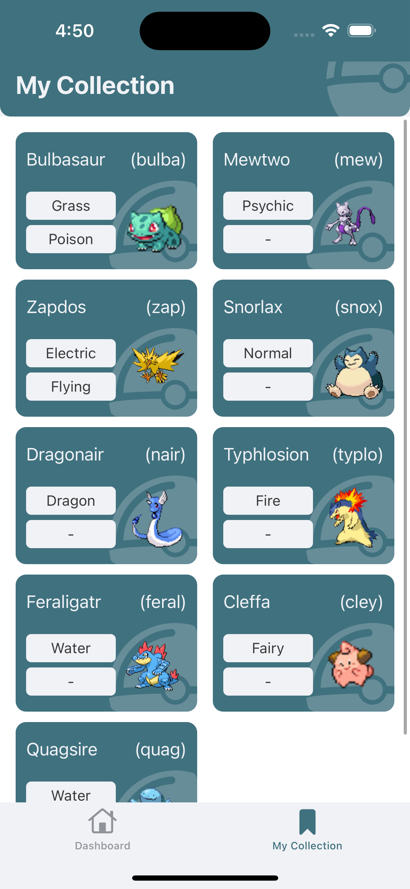

# Pokedex #
Pokedex is an application that can display pokemon information. in this app we can catch pokemon where the pokemon will be stored locally using coredata.

### Design Pattern & Architecture Pattern ###
MVVM(Model View ViewModel) + Clean Architecture

### Tech & Dependencies ###
* [Swift](https://developer.apple.com/swift/)
* [UIKit](https://developer.apple.com/documentation/uikit)
* [Core Data](https://developer.apple.com/documentation/coredata)
* [Alamofire](https://github.com/Alamofire/Alamofire)
* [Kingfisher](https://github.com/onevcat/Kingfisher)
* [Lottie](https://github.com/airbnb/lottie-ios)
* [Netfox](https://github.com/kasketis/netfox)
* [RxSwift](https://github.com/ReactiveX/RxSwift)

### API ###
* [Pokemon API](https://pokeapi.co)

### Screenshots ###
   
